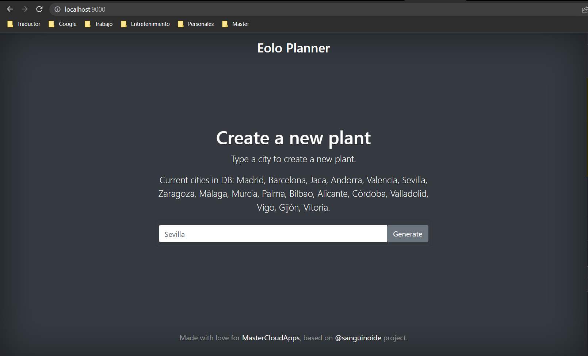
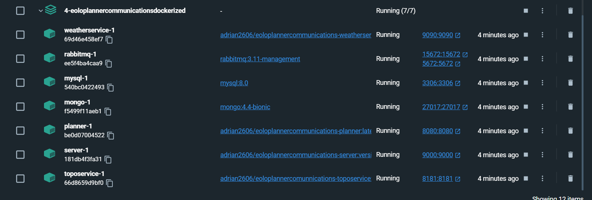

# eoloPlannerCommunicationsDockerized
Dockerize an application which has relational and no-relational dbs, grpc and grapthql protocols and a rabbitmq broker

Los servicios a desplegar han sido los siguientes
    - Servicio planner en el 8080 (spring)
    - Servicio server en el 9000 (quarkus)
    - Servicio topo en el 8181 (spring)
    - Servicio weather en el 9090 (quarkus)
    - Base de datos mysql en el 3306
    - Base de datos mongo en el 27017
    - Broker de mensajeria rabbitmq en el 5672

Los comandos utilizados han sido
    - Para listar contenedores: docker ps -a
    - Para listar imagenes: docker images
    - Para borrar imagenes: docker rmi "id"
    - Para generar una imagen:  ./mvnw install
    - Para generar una imagen nativa:  ./mvnw install -Dnative
    - Para generar una imagen de un dockerfile: docker build -f "nombre_fichero" -t "nombre_imagen" .
    - Para generar una imgen con buildpacks: mvn spring-boot:build-image
    - Para subir una imagen al docker hub: docker push "nombre imagen"
    - Para traerse una imgen del docker hub: docker pull "nombre imagen"
    - Para levantar un archivo docker compose: docker compose up
    - Para borrar los servicios de un build de docker compose: docker compose down
    - Para ver los logs de un servicio levantado con docker compose: docker-compose logs "nombre_servicio"

El primer modo de desarrollo seria montar la app, generar las imagenes, el docker dompose y levantar los servicios una vez definidos

Para ejecutar la aplicación se debe colocar en la raiz del proyecto y ejecutar el siguiente comando:
    - docker compose up
Despues acceder a la siguiente url: http://localhost:9000/

Comprobamos que todos los servicios estan corriendo

Los volumenes montados se han hecho sobre la raiz de este proyecto en las carpetas
    - mongo
    - mysql
    - rabbitmq

El segundo modo de desarrollo seria utilizar devcontainers para levantar un contenedor e ir montando la app sobre el desde el IDE
